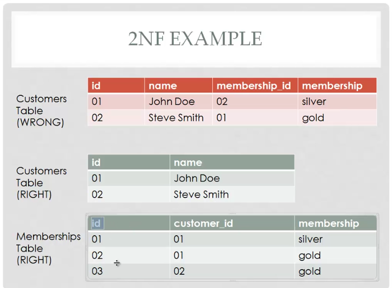

# Normalizations, Reletional DB Design

## Reletional Model Rules

- Each Column Value mst be a Single Value only
- Each Column Name Must be Unique

## Functioal Dependencies

A Functional Dependency Describes a relaationship between columns with in a single reletions

- a column is dependent on another of one value can be used to determine the value of another

```
Examples: first_name Is functionally dependent on id bcoz id can be used to uniquely determine the value of first_name
```

## Normalizations

Normalization is the process of organizing the fields and tab;e of a relational database to minimize redundancy and dependency

Divide table into smaller tables and definig reletionship between them

```
Types (1NF) (2NF) (3NF)
```

### First Normal Form 1NF

- non repeating Duplicate fields
- Each Row Should Contain only one Value
- each ro Should Be Unique identified by Primary Key


```
Explain
in customer Table(Wrong) we repeat id twice name john doe and id 01 , name can be repeat but should not repeat
to solve that problem we Devide table in two customer table and membership table now each table id column contain unique value in membership table customer_id points to id of customer table id
```

### 2NF

- should be in 1NF
- non-key-fields depends on all components of the primary key



```
in Customer tables(wrong) we dont need to add membership_id and membership
to solution on that we devide table in two part customer table and membership table
now membership table contain id that uniqly identifies the id primary key with addition contain customer_id and membership name
```

### And coding style tests

Explain what these tests test and why

```
Give an example
```

## Deployment

Add additional notes about how to deploy this on a live system

## Built With

- [Dropwizard](http://www.dropwizard.io/1.0.2/docs/) - The web framework used
- [Maven](https://maven.apache.org/) - Dependency Management
- [ROME](https://rometools.github.io/rome/) - Used to generate RSS Feeds

## Contributing

Please read [CONTRIBUTING.md](https://gist.github.com/PurpleBooth/b24679402957c63ec426) for details on our code of conduct, and the process for submitting pull requests to us.

## Versioning

We use [SemVer](http://semver.org/) for versioning. For the versions available, see the [tags on this repository](https://github.com/your/project/tags).

## Authors

- **Billie Thompson** - _Initial work_ - [PurpleBooth](https://github.com/PurpleBooth)

See also the list of [contributors](https://github.com/your/project/contributors) who participated in this project.

## License

This project is licensed under the MIT License - see the [LICENSE.md](LICENSE.md) file for details

## Acknowledgments

- Hat tip to anyone whose code was used
- Inspiration
- etc
